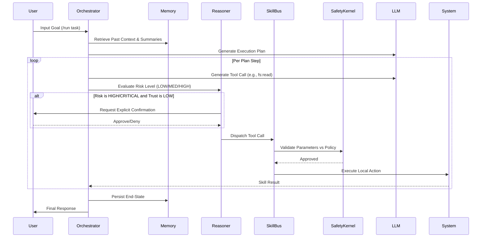

# NeuralClaw 🐾

NeuralClaw is a highly resilient, local-first autonomous AI agent platform. It features an advanced cognitive architecture with planning, reasoning, memory, tool use, and a robust safety kernel designed to safely navigate complex, multi-step tasks.

## Key Features

- 🧠 **Dynamic Cognitive Architecture**: Combines a Planner (task breakdown), Reasoner (risk evaluation), and Executor (tool dispatch) with graceful recovery mechanisms to prevent infinite loops.
- 🔌 **Plug & Play Provider Support**: Native support for **Bytez, OpenAI, Anthropic, Gemini**, and local models via **Ollama**. Model changes dynamically update capability profiles (e.g., tool-calling vs chat-only).
- 🛠️ **Extensible Skill Bus**: Built-in skills for Terminal execution, Filesystem access, Web scraping, and Web search. Register new plugins easily via `yaml` + python or Markdown (`SKILL.md`) manifests.
- 🛡️ **Zero-Trust Safety Kernel**: Real-time evaluation of all tool calls. Features strict path-traversal prevention (`Path.is_relative_to()`), CLI command blanklisting, and granular trust levels (`low`, `medium`, `high`) enforcing user-confirmation gates for HIGH and CRITICAL risk operations.
- 💾 **Multi-Tiered Memory**: 
    - **Short Term**: SQLite-backed conversational session turns. Includes automatic summarization and context compression via `/compact`.
    - **Long Term**: Thread-pooled Chroma DB integration for semantic embedding search over past episodes and task results.
- 📱 **Interfaces**: Ships with a rich interactive `cli` REPL interface and an asynchronous `telegram` bot interface. 

## Architecture & Workflow

NeuralClaw operates on a cyclic execution model, dynamically mapping inputs through a safety-first Tool Bus. 

### Core Execution Flow



### Directory Structure

```text
openclaw_alternative/
├── agent/                  # Core loop, Executor, Reasoner, Planner
│   ├── executor.py         # Routes ToolCalls through the SkillBus
│   ├── orchestrator.py     # Main event loops (ask, autonomous run)
│   ├── reasoner.py         # Evaluates operational risk heuristics
│   └── response_synthesizer.py # Formats streaming CLI outputs
├── brain/                  # LLM Provider integrations
│   ├── capabilities.py     # Dynamic feature-flag probing (Ollama/OpenAI)
│   ├── llm_factory.py      # Provider resolution and API assertions
│   └── ...                 # Clients (anthropic, bytez, gemini, etc.)
├── config/                 # Pydantic Settings & YAML configuration
│   ├── config.yaml         # User-facing behavior toggles
│   └── settings.py         # Strict schema validation
├── interfaces/             # Externally facing UI layers
│   ├── cli.py              # Interactive Rich terminal REPL
│   └── telegram.py         # Asynchronous bot interface
├── memory/                 # Persistence routing
│   ├── embedder.py         # Thread-pooled text-embedding generation
│   ├── memory_manager.py   # State bridging (Short-Term/Long-Term)
│   └── ...                 # SQLite Conversations + Chroma Vectors
├── observability/          # Logging, tracing, and metrics
├── safety/                 # Parameter policing
│   ├── risk_scorer.py      # Identifies potentially destructive inputs
│   ├── safety_kernel.py    # Master gatekeeper for capability granting
│   └── whitelist.py        # Path traversal and Shell injections guards
├── skills/                 # The extensible action layer
│   ├── builtin/            # Core actions (fs, bash, browser, api)
│   ├── plugins/            # User-defined / 3rd-party YAML/Python tools
│   ├── bus.py              # Tool routing and timeout handlers
│   └── md_loader.py        # Parses openclaw SKILL.md formats
└── main.py                 # Application bootstrap & health-checks
```

## Getting Started

### Prerequisites
- Python 3.11+
- [Ollama](https://ollama.com/) (Optional: for local models)

### Installation

1. Clone the repository and navigate to the project directory:
   ```bash
   git clone https://github.com/gabimaruu/neuralclaw.git
   cd neuralclaw
   ```

2. Create and activate a virtual environment:
   ```bash
   python3.11 -m venv venv
   source venv/bin/activate
   ```

3. Install requirements:
   ```bash
   pip install -r requirements.txt
   ```

4. Environment Variables:
   Copy the example environment securely and populate your required keys:
   ```bash
   cp .env.example .env
   ```
   *Note: OpenClaw will automatically validate API keys at fast-fail startup.*

### Usage

**Start the interactive CLI interface (Default):**
```bash
python main.py
```
Or specify it explicitly:
```bash
python main.py --interface cli
```

**Start the Telegram Bot interface:**
(Requires `TELEGRAM_BOT_TOKEN` and `TELEGRAM_AUTHORIZED_USERS` in your `.env`)
```bash
python main.py --interface telegram
```

## Example Use Cases

Once the CLI is running, you can interact with NeuralClaw naturally.

**1. Autonomous Research & Reporting**
Give the agent a complex goal and let it plan, search the web, and synthesize a file:
```text
/run Search for the latest updates on Python 3.13 features, summarize them, and save the result to current_python_updates.md in my workspace.
```

**2. Local Codebase Refactoring**
Ask the agent to modify your local codebase using its filesystem tools:
```text
/run Read through the src/ directory and add type hints to all Python functions missing them. Create a git branch and commit the changes when done.
```

**3. Interactive Data Fetching**
Use it as a smart assistant that can interact with APIs and the terminal:
```text
/ask Check if port 8080 is currently in use on my machine, and if so, tell me the process ID.
```

## CLI Commands

| Command | Description |
|---------|-------------|
| `/ask <msg>` | Send a standard chat message to the agent |
| `/run <goal>`| Initiate autonomous, multi-step task planning towards a goal |
| `/model`     | Open the interactive selector to switch models mid-flight |
| `/tools`     | List all loaded and available skills/tools |
| `/status`    | View current session context and internal states |
| `/trust`     | Set trust layer (`low`, `medium`, `high`) |
| `/grant`     | Grant dangerous capabilities to the active session (`fs:delete`, etc.) |
| `/compact`   | Compact internal memory to save context limits |

## Adding Custom Skills

NeuralClaw supports two ways to extend its capabilities. Drop new skills into the `skills/plugins/` directory:

### 1. Python Skills (Advanced)
Create a `.py` file inheriting from `SkillBase`. Perfect for complex logic, dynamic schemas, and heavy API integrations.
```python
from skills.base import SkillBase
from skills.types import SkillManifest, SkillResult, RiskLevel

class MyCustomSkill(SkillBase):
    def get_manifest(self) -> SkillManifest:
        return SkillManifest(
            name="hello_world",
            description="Returns a friendly greeting.",
            category="Custom",
            risk_level=RiskLevel.LOW,
            parameters={"type": "object", "properties": {"name": {"type": "string"}}},
        )

    async def execute(self, call) -> SkillResult:
        name = call.arguments.get("name", "World")
        return SkillResult.ok(self.name, call.id, f"Hello, {name}!")
```

### 2. Markdown Skills (Declarative)
Create a `.md` file with a YAML frontmatter block. Perfect for prompt-based workflows and system prompts.
```markdown
---
name: explain_code
description: Explains standard python code snippets.
category: Developer
risk_level: LOW
parameters:
  type: object
  properties:
    code:
      type: string
---
You are a senior developer. Explain the following code concisely:
{{code}}
```

## Safety Controls

NeuralClaw defaults to the `low` trust setting, securely intercepting filesystem, HTTP, and terminal requests before execution.
You can configure global operational limits within `config/config.yaml`:
```yaml
safety:
  default_permission_level: "read"
  require_confirmation_for:
    - "HIGH"
    - "CRITICAL"
```

## Developer Notes

- `agent/`: Core reasoning, orchestration, and session state.
- `skills/`: The Skill Bus architecture and manifest registries.
- `safety/`: Kernel validation routing and risk scoring.
- `brain/`: LLM capability probing, clients, and API request schemas.
- **Testing**: Run the full suite with `pytest`: 
  ```bash
  venv/bin/python -m pytest tests/
  ```

---
Built as a highly-resilient, secure alternative to open-ended agent infrastructures.
