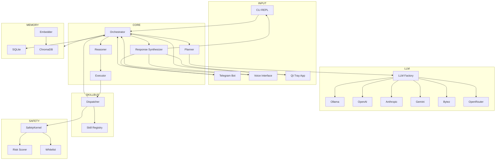
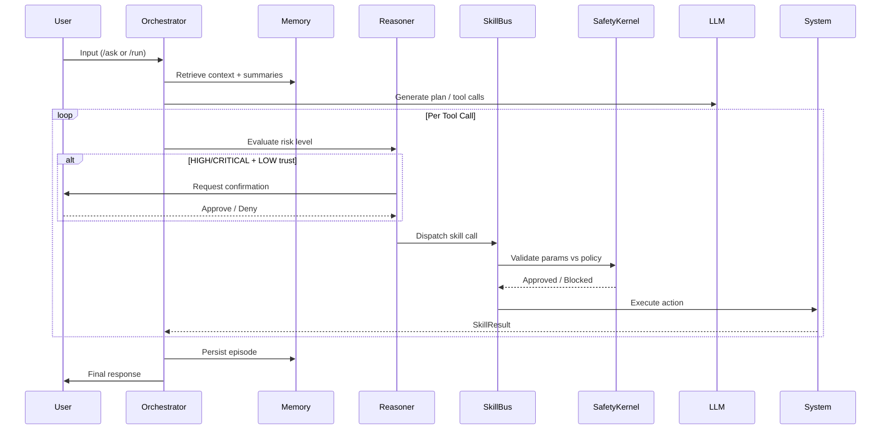

<p align="center">
  <br/>
  <strong>
    <code>███╗   ██╗███████╗██╗   ██╗██████╗  █████╗ ██╗      ██████╗██╗      █████╗ ██╗    ██╗</code><br/>
    <code>████╗  ██║██╔════╝██║   ██║██╔══██╗██╔══██╗██║     ██╔════╝██║     ██╔══██╗██║    ██║</code><br/>
    <code>██╔██╗ ██║█████╗  ██║   ██║██████╔╝███████║██║     ██║     ██║     ███████║██║ █╗ ██║</code><br/>
    <code>██║╚██╗██║██╔══╝  ██║   ██║██╔══██╗██╔══██║██║     ██║     ██║     ██╔══██║██║███╗██║</code><br/>
    <code>██║ ╚████║███████╗╚██████╔╝██║  ██║██║  ██║███████╗╚██████╗███████╗██║  ██║╚███╔███╔╝</code><br/>
    <code>╚═╝  ╚═══╝╚══════╝ ╚═════╝ ╚═╝  ╚═╝╚═╝  ╚═╝╚══════╝ ╚═════╝╚══════╝╚═╝  ╚═╝ ╚══╝╚══╝</code>
  </strong>
  <br/><br/>
  <em>All-in-one autonomous AI agent — 6 LLM providers, 6 interfaces (CLI/Web/Voice/Telegram/Qt/Gateway), zero-trust safety kernel, dual memory, and a pluggable skill bus. Switch providers mid-session. Run fully local. No cloud required.</em>
  <br/><br/>
  <a href="#getting-started">Quickstart</a> · <a href="#architecture">Architecture</a> · <a href="#cli-commands">Commands</a> · <a href="#clawhub-bridge">ClawHub Bridge</a> · <a href="#safety-controls">Safety</a>
</p>

<p align="center">
  
  
  
  
  
</p>

---

## What is NeuralClaw?

NeuralClaw is an all-in-one autonomous AI agent that runs anywhere — 6 LLM providers (Ollama, OpenAI, Anthropic, Gemini, Bytez, OpenRouter), 6 interfaces (CLI, Web UI, Voice, Telegram, Gateway, Qt), zero-trust safety kernel, dual memory (SQLite + ChromaDB), and a pluggable skill bus with ClawHub community support.

Unlike most agent frameworks that lock you into one LLM or one interface, NeuralClaw is designed to be provider-agnostic and interface-agnostic from day one. Switch models mid-session with `/model`. Run fully offline with Ollama. Deploy as a Telegram bot, voice assistant, or browser UI — same core, different face.

---

## Features

| Category | Details |
|----------|---------|
| 🧠 **Cognitive Engine** | Planner → Reasoner → Executor loop with dynamic re-planning, automatic fallback to chat-only mode, and context compression |
| 🔌 **6 LLM Providers** | **Ollama** (local), **OpenAI**, **Anthropic**, **Gemini**, **Bytez**, **OpenRouter** — hot-swap mid-session with `/model` |
| 📱 **6 Interfaces** | Rich CLI, Gateway CLI, **Web UI (admin panel)**, Telegram bot, Voice (Whisper + Piper), Qt tray app |
| 🛠️ **Skill Bus** | Built-in skills for terminal, filesystem, web fetch, web search + drop-in Python and Markdown plugins |
| 🌐 **ClawHub Bridge** | Install and run community skills from [ClawHub](https://clawhub.ai) with 3-tier sandboxed execution |
| 🛡️ **Zero-Trust Safety** | Path-traversal prevention, command whitelisting, capability-gated permissions, and user-confirmation gates |
| 💾 **Dual Memory** | Short-term SQLite conversation buffer with `/compact` + long-term ChromaDB semantic vector search |
| 🌐 **WebSocket Gateway** | Decoupled control plane — all interfaces connect via WebSocket instead of direct orchestrator coupling |
| 🖥️ **Web Admin Panel** | 5-tab browser UI: Chat, Settings (config.yaml editor), Skills manager, Env vars editor, System dashboard |
| ⏰ **Task Scheduler** | Background cron-like task execution with heartbeat check-ins |
| 🎭 **Persona System** | Customize agent personality via `SOUL.md` workspace files |

---

## Architecture

### Data Flow Diagram



### Core Execution Flow



### Directory Structure

```text
neuralclaw/
├── agent/                      # Cognitive engine
│   ├── orchestrator.py         # Main loop — /ask, /run, autonomous mode
│   ├── planner.py              # Multi-step task decomposition
│   ├── reasoner.py             # Risk heuristics + reflection
│   ├── executor.py             # SkillCall dispatch routing
│   ├── response_synthesizer.py # Streaming output formatting
│   ├── session.py              # Per-user state, turns, trust
│   └── workspace.py            # SOUL.md persona loading
│
├── brain/                      # LLM abstraction layer
│   ├── llm_client.py           # Base client + failover chain
│   ├── ollama_client.py        # Ollama (local)
│   ├── openai_client.py        # OpenAI GPT-4o, o1, etc.
│   ├── anthropic_client.py     # Claude 3.5 / 4
│   ├── gemini_client.py        # Google Gemini
│   ├── bytez_client.py         # Bytez hub
│   ├── openrouter_client.py    # OpenRouter aggregator
│   ├── capabilities.py         # Dynamic feature probing
│   └── types.py                # LLMConfig, Message, Provider
│
├── config/
│   ├── config.yaml             # All user-facing settings
│   └── settings.py             # Pydantic validation + merge
│
├── interfaces/
│   ├── cli.py                  # Rich terminal REPL
│   ├── telegram.py             # Async Telegram bot
│   ├── voice.py                # Whisper STT + Piper TTS
│   └── model_selector.py       # Interactive model picker
│
├── kernel/
│   └── kernel.py               # Assembly — wires all subsystems
│
├── memory/
│   ├── memory_manager.py       # Short-term ↔ long-term bridge
│   ├── chroma_store.py         # Vector embeddings (ChromaDB)
│   ├── sqlite_store.py         # Conversation persistence
│   └── embedder.py             # Thread-pooled text embedding
│
├── safety/
│   ├── safety_kernel.py        # Master gatekeeper
│   ├── risk_scorer.py          # Capability + command analysis
│   └── whitelist.py            # Path traversal + shell guards
│
├── skills/
│   ├── base.py                 # SkillBase ABC
│   ├── bus.py                  # SkillBus — dispatch, retry, timeout
│   ├── registry.py             # Name → SkillBase instance map
│   ├── loader.py               # Python skill discovery
│   ├── md_loader.py            # Markdown SKILL.md loader
│   ├── md_skill.py             # MarkdownSkill runtime
│   ├── types.py                # SkillManifest, SkillCall, SkillResult
│   ├── builtin/                # Core skills
│   │   ├── terminal.py         #   └─ Shell command execution
│   │   ├── filesystem.py       #   └─ File read/write/delete
│   │   ├── web_fetch.py        #   └─ HTTP page fetching
│   │   └── web_search.py       #   └─ SerpAPI web search
│   ├── plugins/                # Drop-in user skills
│   └── clawhub/                # ClawHub Bridge Adapter
│       ├── bridge_parser.py    #   └─ SKILL.md frontmatter parser
│       ├── bridge_executor.py  #   └─ 3-tier executor (prompt/http/binary)
│       ├── bridge_loader.py    #   └─ Auto-discovery + registration
│       ├── clawhub_skill.py    #   └─ SkillBase wrapper
│       ├── dependency_checker.py#  └─ Binary + env checks
│       └── env_injector.py     #   └─ Env var validation
│
├── onboard/
│   ├── wizard.py               # Interactive setup wizard
│   ├── skill_installer.py      # Install skills from registry/URL
│   └── clawhub_installer.py    # ClawHub install/search/list/remove
│
├── scheduler/
│   └── scheduler.py            # Background task runner + heartbeat
│
├── observability/
│   └── logger.py               # Structured logging (structlog)
│
├── app/                        # Qt voice tray app
├── mcp/                        # Model Context Protocol servers
├── main.py                     # Entry point + bootstrap
└── exceptions.py               # Full exception hierarchy
```

---

## Getting Started

Two ways to run NeuralClaw — pip install (quick start) or clone (for development).

---

### Prerequisites

| Requirement | Notes |
|---|---|
| **Python 3.11+** | Required |
| **Ollama** *(optional)* | For fully local inference — [ollama.com](https://ollama.com) |
| **API key** *(optional)* | OpenAI, Anthropic, Gemini, Bytez, or OpenRouter |

> At least one LLM source is required — either Ollama running locally, or one API key in `.env`.

---

### Method 1 — pip install

> ⚠️ Currently published on **TestPyPI** for early testing.

```bash
# Create and activate a virtual environment
python3 -m venv neuralclaw-env
source neuralclaw-env/bin/activate        # Windows: neuralclaw-env\Scripts\activate

# Install (--extra-index-url pulls dependencies from PyPI)
pip install neural-claw==1.0.0 \
  --index-url https://test.pypi.org/simple/ \
  --extra-index-url https://pypi.org/simple

# Confirm it works
neuralclaw --help
```

Create a working directory, then add your `.env` and `config.yaml`:

```bash
mkdir my-agent && cd my-agent
```

**.env**
```bash
# At least one LLM source required
OPENAI_API_KEY=
ANTHROPIC_API_KEY=
GEMINI_API_KEY=
BYTEZ_API_KEY=
OPENROUTER_API_KEY=

# Only needed for Telegram interface
TELEGRAM_BOT_TOKEN=

# Only needed for web_search skill
SERPAPI_API_KEY=
```

**config.yaml** — see the full reference in [Configuration Reference](#configuration-reference). Minimal example:

```yaml
llm:
  default_provider: "ollama"   # or openai | anthropic | gemini | bytez | openrouter
  default_model: "qwen3:8b"
```

Run the interactive setup wizard (first time only):

```bash
neuralclaw onboard
```

**Start the agent:**

```bash
neuralclaw                                      # CLI REPL (default)
neuralclaw --interface cli                      # CLI (explicit)
neuralclaw --interface webui                    # Web UI  →  http://127.0.0.1:8080
neuralclaw --interface telegram                 # Telegram bot
neuralclaw --interface voice                    # Voice  (Whisper STT + Piper TTS)
neuralclaw --interface voice-app                # Qt desktop tray app
neuralclaw --interface gateway                  # WebSocket gateway server
neuralclaw --interface gateway-cli              # Thin CLI client for the gateway
```

**Install skills:**

```bash
neuralclaw install web-search                   # install by slug
neuralclaw install ./my_skill.py                # install from local file
neuralclaw install username/repo                # install from GitHub shorthand
neuralclaw install https://raw.github...        # install from raw URL
neuralclaw install web-search --force           # overwrite if already installed
neuralclaw skills                               # list all installable skills
neuralclaw skills cyber                         # filter list by keyword
```

**Other flags:**

```bash
neuralclaw --config path/to/config.yaml
neuralclaw --log-level DEBUG
neuralclaw --enable-mcp
neuralclaw --skip-health-check                  # skip LLM health check on startup
```

---

### Method 2 — Clone (recommended for development)

```bash
git clone https://github.com/prithvi-01x/neuralclaw.git
cd neuralclaw

python3 -m venv venv
source venv/bin/activate

pip install -r requirements.txt

cp .env.example .env
# edit .env and add your key(s)
```

Run setup wizard:

```bash
python main.py onboard
```

Start the agent — same interfaces, same flags, just replace `neuralclaw` with `python main.py`:

```bash
python main.py                                  # CLI (default)
python main.py --interface webui
python main.py --interface telegram
python main.py --interface voice
python main.py --interface voice-app
python main.py --interface gateway
python main.py --interface gateway-cli --gateway-url ws://localhost:9090
python main.py install port-scan
python main.py skills
python main.py --log-level DEBUG
python main.py --enable-mcp
python main.py --skip-health-check
```

---

## CLI Commands

| Command | Description |
|---------|-------------|
| `(just type)` | Send a message to the agent directly |
| `/ask <msg>` | Explicit message send |
| `/run <goal>` | Autonomous multi-step task execution |
| `/model` | Interactive LLM model switcher |
| `/tools` or `/skills` | List all registered skills |
| `/status` | Session stats and context info |
| `/usage` | Token counts and estimated cost |
| `/memory <query>` | Semantic search over long-term memory |
| `/compact` | Summarize old turns to free context window |
| `/trust <low\|medium\|high>` | Set trust level |
| `/grant <capability>` | Grant a capability (e.g. `fs:delete`) |
| `/revoke <capability>` | Revoke a granted capability |
| `/capabilities` | Show active session capabilities |
| `/resetcaps` | Re-enable tool calling after fallback |
| `/clawhub <action>` | Manage ClawHub skills (see below) |
| `/clear` | Clear conversation history |
| `/cancel` | Cancel running task |
| `/help` | Show all available commands |
| `exit` / `quit` / `Ctrl+D` | Exit |

---

## LLM Providers

NeuralClaw supports 6 providers, switchable mid-session via `/model`:

| Provider | Config Key | Env Variable | Notes |
|----------|-----------|-------------|-------|
| **Ollama** | `ollama` | — | Local, no API key needed |
| **OpenAI** | `openai` | `OPENAI_API_KEY` | GPT-4o, o1, etc. |
| **Anthropic** | `anthropic` | `ANTHROPIC_API_KEY` | Claude 3.5 / 4 |
| **Gemini** | `gemini` | `GEMINI_API_KEY` | Google Gemini Pro |
| **Bytez** | `bytez` | `BYTEZ_API_KEY` | Bytez model hub |
| **OpenRouter** | `openrouter` | `OPENROUTER_API_KEY` | Multi-provider aggregator |

### Failover

Configure automatic failover in `config.yaml`:

```yaml
llm:
  default_provider: "ollama"
  default_model: "qwen3:8b"
  retry:
    max_attempts: 3
    base_delay: 1.0
  fallback_providers:
    - openai
    - anthropic
```

---

## Built-in Skills

| Skill | Category | Risk | Capabilities |
|-------|----------|------|-------------|
| `terminal_exec` | System | HIGH | `shell:run` — Execute commands with whitelist enforcement |
| `fs_read` | Filesystem | LOW | `fs:read` — Read files within allowed paths |
| `fs_write` | Filesystem | MEDIUM | `fs:write` — Write/append files |
| `fs_delete` | Filesystem | HIGH | `fs:delete` — Delete files (requires explicit grant) |
| `web_fetch` | Network | LOW | `net:fetch` — Fetch web pages |
| `web_search` | Network | LOW | `net:fetch` — Search the web via SerpAPI |

---

## Adding Custom Skills

### Python Skills

Create a `.py` file in `skills/plugins/`:

```python
from skills.base import SkillBase
from skills.types import SkillManifest, SkillResult, RiskLevel

class MySkill(SkillBase):
    manifest = SkillManifest(
        name="my_skill",
        version="1.0.0",
        description="Does something useful",
        category="Custom",
        risk_level=RiskLevel.LOW,
        parameters={
            "type": "object",
            "properties": {
                "input": {"type": "string", "description": "What to process"},
            },
            "required": ["input"],
        },
    )

    async def execute(self, **kwargs) -> SkillResult:
        call_id = kwargs.get("_skill_call_id", "")
        user_input = kwargs.get("input", "")
        return SkillResult.ok(self.manifest.name, call_id, f"Processed: {user_input}")
```

### Markdown Skills

Create a `SKILL.md` file in `skills/plugins/`:

```markdown
---
name: explain_code
description: Explains Python code concisely
category: Developer
risk_level: LOW
parameters:
  type: object
  properties:
    code:
      type: string
      description: The code to explain
---
You are a senior developer. Explain the following code concisely:

{{code}}
```

---

## ClawHub Bridge

The ClawHub Bridge Adapter lets you install and run community-built skills from the [ClawHub](https://clawhub.ai) ecosystem. Skills are `SKILL.md` files with enhanced frontmatter that NeuralClaw auto-detects and routes through the appropriate execution tier.

### Three Execution Tiers

| Tier | Trigger | Risk | How It Works |
|------|---------|------|--------------|
| **1 — Prompt** | No bins or install directives | LOW | Skill body injected as LLM system prompt |
| **2 — HTTP** | Only requires `curl`/`wget` | LOW | HTTP calls routed through `httpx` (no shell) |
| **3 — Binary** | Requires CLI tools or install directives | HIGH | Routed through `terminal_exec` + SafetyKernel |

### ClawHub CLI Commands

```bash
# From inside the agent CLI
/clawhub search todoist         # Search the registry
/clawhub install todoist-cli    # Install a skill
/clawhub list                   # List installed skills
/clawhub info todoist-cli       # Show skill details
/clawhub remove todoist-cli     # Remove a skill

# From the terminal directly
python main.py clawhub install todoist-cli
python main.py clawhub list
```

### Example SKILL.md (Tier 3 — Binary)

```markdown
---
name: todoist-cli
description: Manage Todoist tasks from NeuralClaw
version: "1.2.0"
metadata:
  openclaw:
    emoji: "✅"
    primaryEnv: TODOIST_API_TOKEN
    requires:
      bins: [todoist]
      env: [TODOIST_API_TOKEN]
    install:
      - kind: brew
        formula: todoist
        bins: [todoist]
---
You are a Todoist assistant. Use the `todoist` CLI to manage tasks...
```

### Configuration

```yaml
# config/config.yaml
clawhub:
  enabled: true
  skills_dir: "./data/clawhub/skills"
  registry_url: "https://clawhub.ai"
  execution:
    allow_binary_skills: true
    auto_install_deps: false        # requires explicit opt-in
    sandbox_binary_skills: true
  env:
    block_on_missing_env: true
  risk_defaults:
    prompt_only: "LOW"
    api_http: "LOW"
    binary_execution: "HIGH"
```

---

## Safety Controls

NeuralClaw defaults to **zero-trust**. Every tool call passes through the SafetyKernel before execution.

### Trust Levels

| Level | Behavior |
|-------|----------|
| `low` *(default)* | Confirm HIGH and CRITICAL risk actions |
| `medium` | Only confirm CRITICAL risk actions |
| `high` | Auto-approve all actions (**use with care**) |

### Capabilities

Skills declare required capabilities. The agent can only use them if explicitly granted:

| Capability | Scope |
|-----------|-------|
| `fs:read` | Read files within allowed paths |
| `fs:write` | Write/append files |
| `fs:delete` | Delete files (never auto-granted) |
| `shell:run` | Execute whitelisted terminal commands |
| `net:fetch` | HTTP requests and web searches |
| `env:read` | Read environment variables |

Grant capabilities at runtime:

```text
/grant fs:delete
/grant shell:run
/revoke fs:delete
/capabilities
```

### Configuration

```yaml
# config/config.yaml
safety:
  default_permission_level: "read"
  require_confirmation_for:
    - "HIGH"
    - "CRITICAL"

tools:
  terminal:
    whitelist_extra: []           # add extra allowed commands
    docker_sandbox: false         # run commands in Docker
  filesystem:
    allowed_paths:
      - "./data/agent_files"      # restrict file access
```

---

## Memory System

### Short-Term Memory

- SQLite-backed conversation buffer
- Configurable turn limit (`max_short_term_turns`)
- Context compression via `/compact` — summarizes old turns, keeps only the most recent

### Long-Term Memory

- ChromaDB vector store for semantic search
- Thread-pooled embedding generation (`BAAI/bge-small-en-v1.5`)
- Search with: `/memory <query>`

### Configuration

```yaml
memory:
  chroma_persist_dir: "./data/chroma"
  sqlite_path: "./data/sqlite/episodes.db"
  embedding_model: "BAAI/bge-small-en-v1.5"
  max_short_term_turns: 20
  compact_after_turns: 15
  compact_keep_recent: 4
```

---

## Scheduler

Background task execution with configurable concurrency and heartbeat:

```yaml
scheduler:
  timezone: "UTC"
  max_concurrent_tasks: 3
  heartbeat_enabled: true
  heartbeat_interval_minutes: 30
```

---

## Gateway & Web UI

The **Gateway** is a WebSocket control plane that decouples all interfaces from the core agent.

### Web UI Admin Panel

A full browser-based admin panel with 5 tabs:

| Tab | Features |
|-----|----------|
| 💬 **Chat** | Chat with markdown rendering, quick actions, confirmation dialogs |
| ⚙️ **Settings** | Live `config.yaml` editor — all sections editable with type-aware inputs |
| 🔧 **Skills** | View all loaded skills with categories and risk badges, hot-reload button |
| 🔑 **Env Vars** | Manage `.env` API keys — masked values, edit/add via modal |
| 📊 **System** | Dashboard: version, Python, platform, skills/sessions/connections counts |

```bash
python main.py --interface webui
# → Web UI:  http://127.0.0.1:8080
# → Gateway: ws://127.0.0.1:9090
```

### Gateway Configuration

```yaml
gateway:
  host: "127.0.0.1"
  port: 9090
  auth_token: ""            # optional bearer token
  max_connections: 50
```

---

## Voice Interface

NeuralClaw supports hands-free interaction via Whisper STT and Piper TTS:

```yaml
voice:
  enabled: true
  whisper_model: "base.en"
  whisper_device: "cpu"           # or "cuda"
  piper_model_path: ""            # path to .onnx voice model
  wake_word_enabled: false
  wake_word_model: "hey_mycroft"
```

```bash
python main.py --interface voice
```

---

## Testing

```bash
# Run all tests
python -m pytest tests/ --override-ini="addopts="

# Run specific test suites
python -m pytest tests/unit/test_skills.py -v
python -m pytest tests/unit/test_clawhub_bridge.py -v
python -m pytest tests/unit/test_config.py -v
```

---

## Configuration Reference

All settings live in `config/config.yaml` and can be overridden by environment variables in `.env`.

| Section | Description |
|---------|-------------|
| `agent` | Name, version, iteration limits, trust level |
| `llm` | Provider, model, temperature, retry, failover |
| `memory` | Storage paths, embedding model, compaction |
| `tools` | Terminal, filesystem, browser settings |
| `safety` | Permission levels, confirmation gates |
| `gateway` | Host, port, auth token, max connections |
| `clawhub` | Bridge adapter settings, tier risk defaults |
| `telegram` | Bot token, authorized users |
| `scheduler` | Timezone, concurrency, heartbeat |
| `voice` | Whisper, Piper, wake word settings |
| `logging` | Level, log directory, format |
| `mcp` | Model Context Protocol server configs |

---

## Project Principles

- **All-in-one** — 6 LLM providers and 6 interfaces in a single deployable agent
- **Local-first** — runs entirely on your machine with Ollama, no cloud required
- **Zero-trust by default** — every action gated by the SafetyKernel
- **Fail-fast startup** — invalid config or missing keys caught at boot, not mid-task
- **No business logic in the kernel** — `kernel.py` is pure wiring via constructor injection
- **Skills never raise** — they return `SkillResult.fail()` instead of throwing exceptions

---

## Contributing

Contributions are welcome. Please fork the repo, create a feature branch, and open a pull request. Check existing issues before opening a new one.

---

<p align="center">
  <sub>Built as a resilient, provider-agnostic alternative to cloud-dependent agent frameworks.</sub>
</p>
